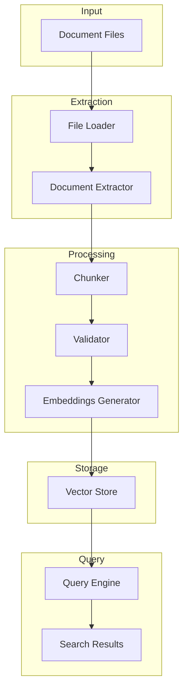

# Spiderweb

> **Scalable document processing and RAG pipeline with intelligent chunking, validation, and pluggable vector stores**

Spiderweb is a production-ready document processing library built for RAG (Retrieval-Augmented Generation) applications. It handles the complex pipeline of extracting, chunking, validating, and storing documents for semantic search and retrieval.

## What is Spiderweb?

Spiderweb takes raw documents (PDFs, Word docs, markdown, etc.) and transforms them into searchable, semantically-meaningful chunks stored in vector databases. It's designed for developers building RAG applications who need:

- **Intelligent chunking** that preserves document structure and semantic boundaries
- **Quality validation** to filter out low-quality or duplicate chunks
- **Scalable batch processing** for thousands of documents
- **Pluggable vector stores** (Qdrant, in-memory, and more)
- **Built-in embeddings** via GlueLLM integration

**The vibe:** Production-ready, well-architected, and designed to handle real-world document processing at scale. Built with the same philosophy as GlueLLM - sensible defaults, clean APIs, and it just works.

## Features

- 📄 **Multi-Format Extraction** - PDF, Word, Excel, PowerPoint, Markdown, and more via markitdown
- 🧩 **Smart Chunking Strategies**
  - Hierarchical (preserves document structure)
  - Semantic (similarity-based boundaries)
  - Sliding window (fixed size with overlap)
  - Sentence-based
- ✅ **Quality Validation Pipeline**
  - Content quality scoring
  - Semantic deduplication
  - Information density checks
  - Optional LLM-based validation
- 🗄️ **Vector Store Integration**
  - Qdrant (local and cloud)
  - In-memory (for development)
  - Extensible for custom stores
- 🔍 **Query Expansion** - Multi-query and HyDE strategies for improved recall
- ⚡ **Batch Processing** - Process thousands of documents efficiently
- 🎯 **Progressive Query** - Start querying before all documents are processed
- 🎯 **Type-Safe Configuration** - Pydantic models for all settings
- 🛠️ **CLI Tools** - Command-line interface for common operations

## Installation

```bash
# Using uv (recommended)
uv pip install spiderweb

# Using pip
pip install spiderweb

# With all optional dependencies
pip install spiderweb[pdf,office,ocr]

# Development installation
git clone https://github.com/Bioto/spiderweb.git
cd spiderweb
uv pip install -e ".[dev]"
```

## Quick Start

### Basic Document Ingestion

```python
import asyncio
from gluellm import GlueLLM
from spiderweb import ingest

async def main():
    # Initialize LLM client for embeddings
    llm = GlueLLM()
    
    # Ingest a document
    doc = await ingest("document.pdf", llm_client=llm)
    print(f"Created {len(doc.chunks)} chunks")
    
    # Access chunks
    for chunk in doc.chunks:
        print(f"Chunk {chunk.metadata.chunk_index}: {chunk.content[:100]}...")

asyncio.run(main())
```

### Using the Spiderweb Client

```python
import asyncio
from gluellm import GlueLLM
from spiderweb import Spiderweb

async def main():
    # Create client with configuration
    async with Spiderweb(llm_client=GlueLLM()) as web:
        # Ingest a document
        result = await web.ingest("document.pdf")
        print(f"Chunks created: {result.chunks_created}")
        print(f"Chunks validated: {result.chunks_validated}")
        print(f"Processing time: {result.processing_time_seconds:.2f}s")
        
        # Query the vector store
        results = await web.query("What is the main topic?", top_k=5)
        for chunk in results.chunks:
            print(chunk["content"])

asyncio.run(main())
```

### Batch Processing

```python
from gluellm import GlueLLM
from spiderweb import process_directory

async def main():
    result = await process_directory(
        "/path/to/documents",
        llm_client=GlueLLM(),
        chunker="semantic",
        recursive=True,
    )
    
    print(f"Processed {result.successful_documents}/{result.total_documents} documents")
    print(f"Total chunks: {result.total_chunks}")
    print(f"Average time: {result.average_time_per_document:.2f}s per document")

asyncio.run(main())
```

### Query Expansion for Better Results

```python
from spiderweb import Spiderweb
from spiderweb.models.config import QueryExpansionConfig
from gluellm import GlueLLM

async def main():
    web = Spiderweb(
        llm_client=GlueLLM(),
        vector_store_url="qdrant://localhost:6333/docs"
    )
    
    # Enable query expansion for improved recall
    expansion_config = QueryExpansionConfig(
        enabled=True,
        strategy="multi_query",  # or "hyde"
        num_expansions=3,
    )
    
    results = await web.query(
        "machine learning algorithms",
        top_k=10,
        query_expansion=expansion_config,
    )
    
    print(f"Expanded queries used: {results.expanded_queries}")
    for chunk in results.chunks:
        print(f"Score: {chunk['score']:.3f} - {chunk['content'][:100]}...")

asyncio.run(main())
```

## Core API

### Spiderweb Client

The main client class for document processing with conversation-like state management.

```python
from spiderweb import Spiderweb
from spiderweb.models.config import ChunkerConfig, ValidatorConfig

web = Spiderweb(
    llm_client=GlueLLM(),                    # LLM client for embeddings
    vector_store_url="qdrant://localhost:6333/docs",  # Optional vector store
    chunker_config=ChunkerConfig(...),       # Optional chunking configuration
    validator_config=ValidatorConfig(...),   # Optional validation configuration
)

# Ingest a document
result = await web.ingest("document.pdf")

# Query documents
results = await web.query("What is machine learning?", top_k=10)

# Batch process a directory
batch_result = await web.ingest_directory("/path/to/docs", recursive=True)
```

### Convenience Functions

For one-off operations without maintaining state:

```python
from spiderweb import ingest, query, process_directory

# Quick document ingestion
doc = await ingest("document.pdf", llm_client=llm)

# Quick directory processing
result = await process_directory(
    "/path/to/docs",
    llm_client=llm,
    chunker="hierarchical",
    store="memory",
)

# Quick query
results = await query(
    "What is Python?",
    llm_client=llm,
    vector_store_url="qdrant://localhost:6333/docs",
    top_k=5,
)
```

## Chunking Strategies

Spiderweb provides multiple chunking strategies, each optimized for different document types and use cases.

### Hierarchical Chunking

Preserves document structure by respecting headings and sections.

```python
from spiderweb.models.config import ChunkerConfig

config = ChunkerConfig(
    strategy="hierarchical",
    max_chunk_size=1500,
    chunk_overlap=200,
    preserve_structure=True,
    max_hierarchy_depth=5,
)
```

**Best for:** Structured documents with clear headings (technical docs, reports, articles)

### Semantic Chunking

Creates chunks based on semantic similarity, grouping related content together.

```python
config = ChunkerConfig(
    strategy="semantic",
    max_chunk_size=1000,
    semantic_threshold=0.7,  # Higher = more aggressive splitting
    respect_boundaries=True,
)
```

**Best for:** Documents where meaning matters more than structure (essays, narratives)

### Sliding Window

Fixed-size chunks with overlap for continuity.

```python
config = ChunkerConfig(
    strategy="sliding_window",
    max_chunk_size=1000,
    chunk_overlap=200,
    respect_boundaries=True,  # Respect sentence boundaries
)
```

**Best for:** Uniform processing, when you need consistent chunk sizes

### Sentence-Based

Chunks at sentence boundaries for maximum coherence.

```python
config = ChunkerConfig(
    strategy="sentence",
    max_chunk_size=800,
    min_chunk_size=100,
    respect_boundaries=True,
)
```

**Best for:** Chat applications, Q&A systems where sentence coherence is critical

## Document Extraction

Spiderweb uses [markitdown](https://github.com/microsoft/markitdown) for document extraction, supporting a wide range of formats.

### Supported Formats

- **PDF** - Text extraction with layout preservation
- **Microsoft Office** - Word (.docx), Excel (.xlsx), PowerPoint (.pptx)
- **Markdown** - .md files
- **HTML** - Web pages
- **Text** - Plain text files
- **Images** - With OCR support (optional)

### Extraction Configuration

```python
from spiderweb.models.config import ExtractorConfig

config = ExtractorConfig(
    primary_method="markitdown",
    preserve_formatting=True,
    extract_metadata=True,
    extract_images=False,
    ocr_images=False,  # Requires OCR dependencies
)
```

### OCR Support

For image-based PDFs or image files:

```bash
# Install OCR dependencies
pip install spiderweb[ocr]
```

```python
from spiderweb.extractors.ocr import OCRExtractor

# Use OCR extractor
web = Spiderweb(
    llm_client=llm,
    extractor=OCRExtractor(),
)
```

## Validation Pipeline

Ensure high-quality chunks with Spiderweb's validation pipeline.

### Quality Validation

Automatically scores chunks based on:
- Sentence completeness
- Information density
- Special character ratios
- Balanced punctuation

```python
from spiderweb.models.config import ValidatorConfig

config = ValidatorConfig(
    enable_validation=True,
    min_quality_score=0.5,  # 0-1 scale
    check_completeness=True,
    check_information_density=True,
    min_information_density=0.2,
)
```

### Semantic Deduplication

Remove duplicate or near-duplicate chunks based on semantic similarity.

```python
config = ValidatorConfig(
    enable_deduplication=True,
    deduplication_threshold=0.95,  # Higher = more aggressive
)
```

**How it works:** Computes embeddings for chunks and removes those with cosine similarity above the threshold.

### LLM-Based Validation (Optional)

Use LLM to validate chunk coherence (costs API calls):

```python
config = ValidatorConfig(
    enable_llm_validation=True,
    llm_validation_sample_rate=0.1,  # Validate 10% of chunks
)
```

## Vector Stores

Spiderweb supports multiple vector stores for storing and querying document embeddings.

### In-Memory Store

For development and testing:

```python
web = Spiderweb(
    llm_client=llm,
    # No vector_store_url = uses in-memory store
)
```

### Qdrant

Production-ready vector database:

```python
# Local Qdrant
web = Spiderweb(
    llm_client=llm,
    vector_store_url="qdrant://localhost:6333/my_documents",
)

# Qdrant Cloud
web = Spiderweb(
    llm_client=llm,
    vector_store_url="qdrant://your-cluster.qdrant.io:6333/my_documents",
)
```

### Custom Vector Store Configuration

For fine-grained control:

```python
from spiderweb.models.config import VectorStoreConfig

config = VectorStoreConfig(
    provider="qdrant",
    host="localhost",
    port=6333,
    collection_name="documents",
    api_key=None,  # For cloud deployments
    embedding_dimension=1536,
    distance_metric="cosine",
)

web = Spiderweb(llm_client=llm, store_config=config)
```

## Query Expansion

Improve search recall by automatically generating multiple query variations or hypothetical answers. Query expansion helps match documents even when they use different vocabulary than your query.

### What is Query Expansion?

Query expansion transforms a single query into multiple queries to improve retrieval:

- **Multi-Query:** Generates alternative phrasings with different vocabulary
- **HyDE (Hypothetical Document Embeddings):** Creates a hypothetical answer, then searches for documents matching that answer

Results from all queries are combined using **Reciprocal Rank Fusion (RRF)** for robust ranking.

### Multi-Query Strategy

Generates multiple reformulations of your query to match different vocabularies:

```python
from spiderweb import Spiderweb
from spiderweb.models.config import QueryExpansionConfig

web = Spiderweb(llm_client=llm, vector_store_url="qdrant://localhost:6333/docs")

# Enable multi-query expansion
expansion_config = QueryExpansionConfig(
    enabled=True,
    strategy="multi_query",
    num_expansions=3,
    include_original=True,  # Also search with original query
)

results = await web.query(
    "What is machine learning?",
    top_k=10,
    query_expansion=expansion_config,
)

# Results include expansion metadata
print(f"Expanded queries: {results.expanded_queries}")
print(f"Strategy used: {results.expansion_strategy}")
```

**When to use:** When users might phrase queries differently than document vocabulary (e.g., "ML" vs "machine learning", "fix" vs "repair")

### HyDE Strategy

Generates a hypothetical answer first, then searches for similar content:

```python
expansion_config = QueryExpansionConfig(
    enabled=True,
    strategy="hyde",
    num_expansions=1,
)

results = await web.query(
    "How do I train a neural network?",
    top_k=10,
    query_expansion=expansion_config,
)
```

**When to use:** When you want to match document-style writing rather than question-style queries. Works well for technical content.

### Custom Prompts

Tailor the expansion to your domain:

```python
# Custom multi-query prompt
custom_prompt = """Generate {num_expansions} alternative questions about software engineering.
Focus on technical terminology and different phrasings developers might use.

Query: {query}

Alternative questions:"""

expansion_config = QueryExpansionConfig(
    enabled=True,
    strategy="multi_query",
    custom_prompt=custom_prompt,
    num_expansions=5,
)

# Custom HyDE prompt
hyde_prompt = """Write a technical paragraph that would appear in API documentation 
answering this query. Use specific function names and code terminology.

Query: {query}

Documentation excerpt:"""

expansion_config = QueryExpansionConfig(
    enabled=True,
    strategy="hyde",
    custom_prompt=hyde_prompt,
)
```

### CLI Usage

Query expansion is available through the CLI:

```bash
# Basic multi-query expansion
spiderweb query "machine learning algorithms" \
  --expand \
  --top-k 10

# HyDE strategy
spiderweb query "How to optimize Python code?" \
  --expand \
  --expand-strategy hyde \
  --expand-num 2

# Show expanded queries with verbose mode
spiderweb query "neural networks" \
  --expand \
  --expand-num 5 \
  --verbose \
  --show-scores

# Custom prompt (for specialized domains)
spiderweb query "database indexing" \
  --expand \
  --expand-prompt "Generate {num_expansions} technical variations: {query}"
```

### Advanced Configuration

Fine-tune the RRF algorithm:

```python
expansion_config = QueryExpansionConfig(
    enabled=True,
    strategy="multi_query",
    num_expansions=4,
    include_original=True,
    rrf_k=60,  # RRF constant (higher = less aggressive downranking)
)
```

### Best Practices

**Multi-Query:**
- Use 3-5 expansions for good coverage without redundancy
- Include original query for safety
- Works best with general vocabulary mismatches

**HyDE:**
- Use 1-2 expansions (more can be redundant)
- Excellent for technical/domain-specific content
- Can struggle with very short or ambiguous queries

**Custom Prompts:**
- Include `{query}` and `{num_expansions}` placeholders
- Be specific about desired output format
- Test prompts with your document domain

**Performance:**
- Query expansion adds LLM calls (slower, costs API credits)
- Cache expansion results for repeated queries
- Consider enabling only for complex queries

## Configuration

Spiderweb uses environment variables for configuration, following the `SPIDERWEB_` prefix convention.

### Environment Variables

```bash
# Chunking settings
export SPIDERWEB_DEFAULT_CHUNKER=hierarchical
export SPIDERWEB_DEFAULT_CHUNK_SIZE=1000
export SPIDERWEB_DEFAULT_CHUNK_OVERLAP=200

# Embedding settings
export SPIDERWEB_EMBEDDING_MODEL=openai/text-embedding-3-small
export SPIDERWEB_EMBEDDING_DIMENSION=1536

# Vector store settings
export SPIDERWEB_DEFAULT_VECTOR_STORE=qdrant
export SPIDERWEB_QDRANT_HOST=localhost
export SPIDERWEB_QDRANT_PORT=6333
export SPIDERWEB_DEFAULT_COLLECTION_NAME=spiderweb_documents

# Validation settings
export SPIDERWEB_ENABLE_VALIDATION=true
export SPIDERWEB_MIN_CHUNK_QUALITY_SCORE=0.3
export SPIDERWEB_DEDUPLICATION_THRESHOLD=0.95

# Batch processing settings
export SPIDERWEB_MAX_CONCURRENT_EXTRACTIONS=5
export SPIDERWEB_MAX_CONCURRENT_EMBEDDINGS=10
export SPIDERWEB_BATCH_SIZE=100

# Logging settings
export SPIDERWEB_LOG_LEVEL=INFO
export SPIDERWEB_LOG_FILE_LEVEL=DEBUG
export SPIDERWEB_LOG_DIR=logs
```

### Using .env File

Create a `.env` file in your project root:

```bash
# .env
SPIDERWEB_DEFAULT_CHUNKER=hierarchical
SPIDERWEB_DEFAULT_CHUNK_SIZE=1000
SPIDERWEB_QDRANT_HOST=localhost
SPIDERWEB_QDRANT_PORT=6333
```

### Programmatic Configuration

```python
from spiderweb.config import settings

# Access settings
print(settings.default_chunker)  # "hierarchical"
print(settings.qdrant_host)      # "localhost"
print(settings.embedding_model)  # "openai/text-embedding-3-small"

# Reload after changing .env
from spiderweb.config import reload_settings
settings = reload_settings()
```

## CLI Reference

Spiderweb includes a command-line interface for common operations.

### Ingest Documents

```bash
# Ingest a single document
spiderweb ingest document.pdf

# Ingest a directory
spiderweb ingest /path/to/documents --recursive

# With custom configuration
spiderweb ingest document.pdf \
  --chunker semantic \
  --chunk-size 1500 \
  --vector-store qdrant://localhost:6333/docs
```

### Query Documents

```bash
# Query the vector store
spiderweb query "What is machine learning?" --top-k 5

# With specific collection
spiderweb query "Python tutorials" \
  --vector-store qdrant://localhost:6333/docs \
  --top-k 10 \
  --show-scores

# With query expansion for better recall
spiderweb query "neural networks" \
  --expand \
  --expand-strategy multi_query \
  --expand-num 3 \
  --top-k 10

# HyDE expansion with verbose output
spiderweb query "How to deploy ML models?" \
  --expand \
  --expand-strategy hyde \
  --verbose \
  --show-scores
```

### Progressive Query

Start querying while documents are still being ingested:

```bash
# Process documents and enable progressive querying
spiderweb progressive-query /path/to/documents \
  --query "What are the key findings?" \
  --update-interval 10
```

## Development

### Running Tests

```bash
# Run all tests
pytest tests/

# Run specific test file
pytest tests/test_chunkers.py

# Run with coverage
pytest tests/ --cov=spiderweb --cov-report=html
```

### Code Quality

```bash
# Format code
ruff format .

# Lint code
ruff check .

# Type checking
mypy spiderweb/
```

### Pre-commit Hooks

```bash
# Install pre-commit hooks
pre-commit install

# Run manually
pre-commit run --all-files
```

## Architecture



## Requirements

- **Python:** 3.12+
- **Core Dependencies:**
  - `gluellm>=1.1.0` - LLM and embedding capabilities
  - `markitdown[all]>=0.0.1a2` - Document extraction
  - `qdrant-client>=1.12.0` - Vector storage
  - `pydantic>=2.12.5` - Data validation
  - `pydantic-settings>=2.12.0` - Configuration management
  - `nltk>=3.9.1` - Text processing
  - `spacy>=3.8.0` - NLP operations

See [`pyproject.toml`](pyproject.toml) for complete dependency list.

## License

MIT License - see [LICENSE](LICENSE) file for details.

## Contributing

Contributions are welcome! Please see [CONTRIBUTING.md](CONTRIBUTING.md) for guidelines.

1. Fork the repository
2. Create a feature branch
3. Make your changes
4. Run tests and linters
5. Submit a pull request

## Credits

Built with:
- [GlueLLM](https://github.com/Bioto/glue-llm) - LLM operations and embeddings
- [markitdown](https://github.com/microsoft/markitdown) - Document extraction
- [Qdrant](https://qdrant.tech/) - Vector database

---

**Need Help?** Check out the [examples/](examples/) directory for more usage patterns, or [open an issue](https://github.com/Bioto/spiderweb/issues) if you run into problems.
